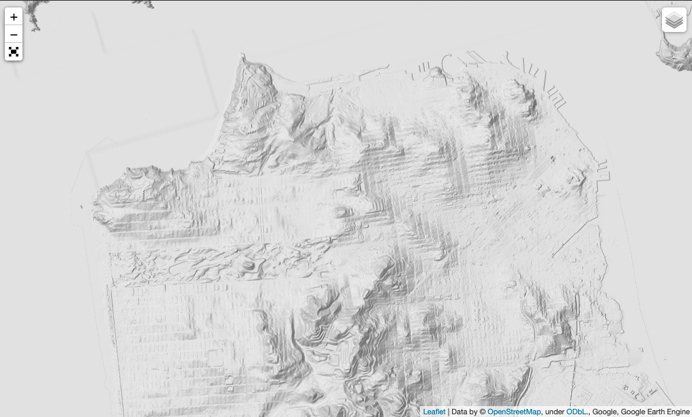
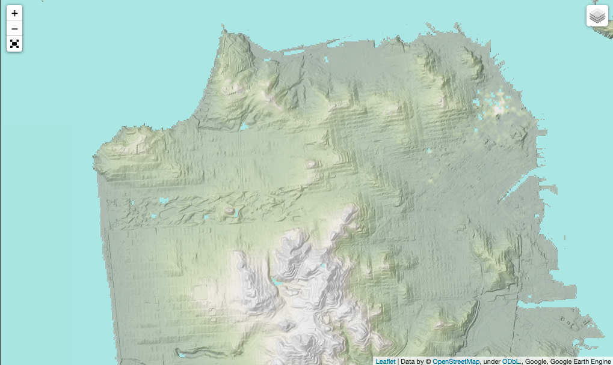
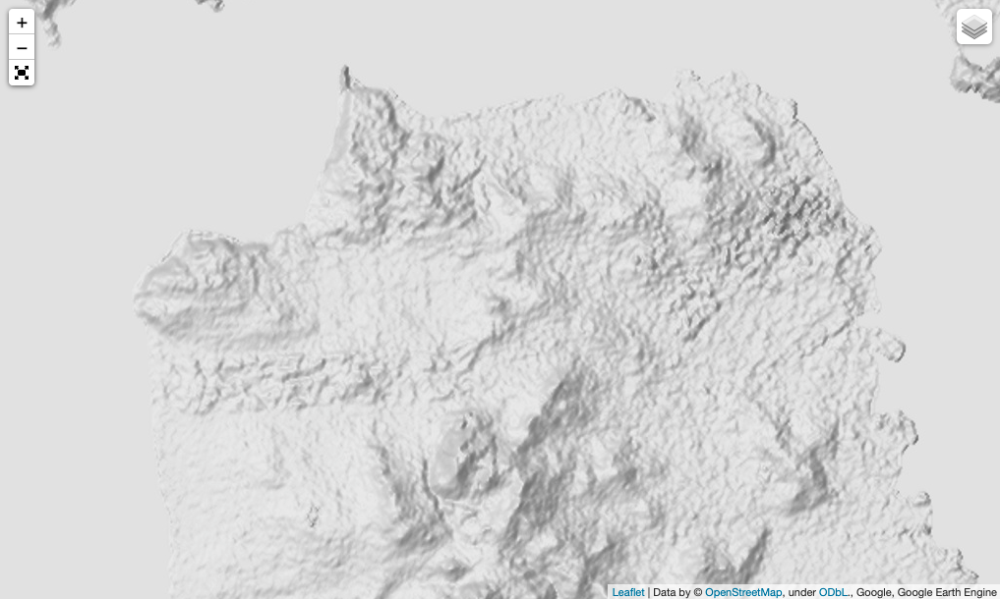
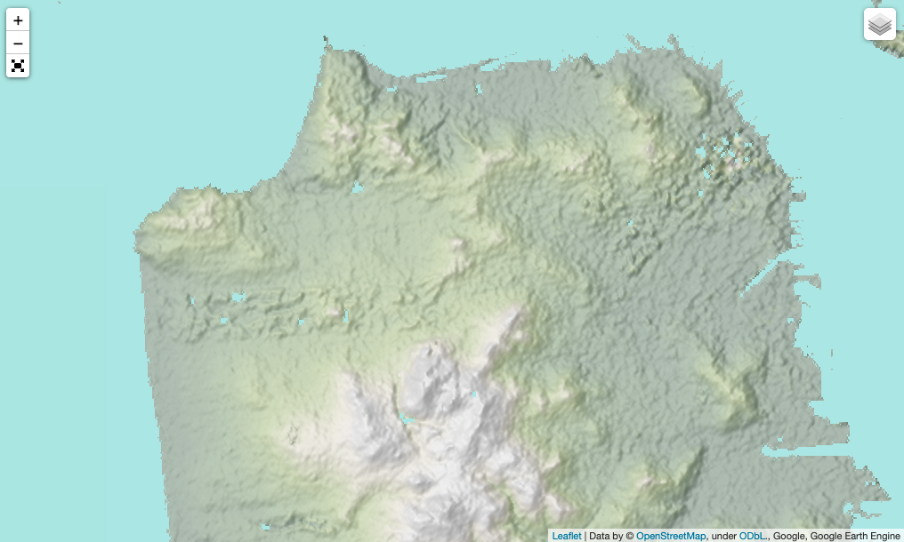
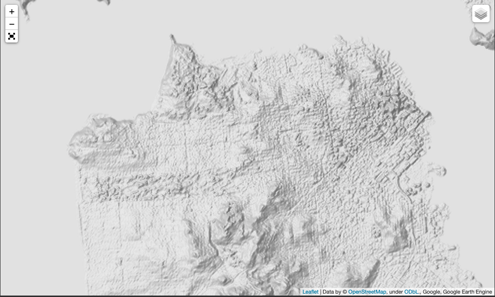
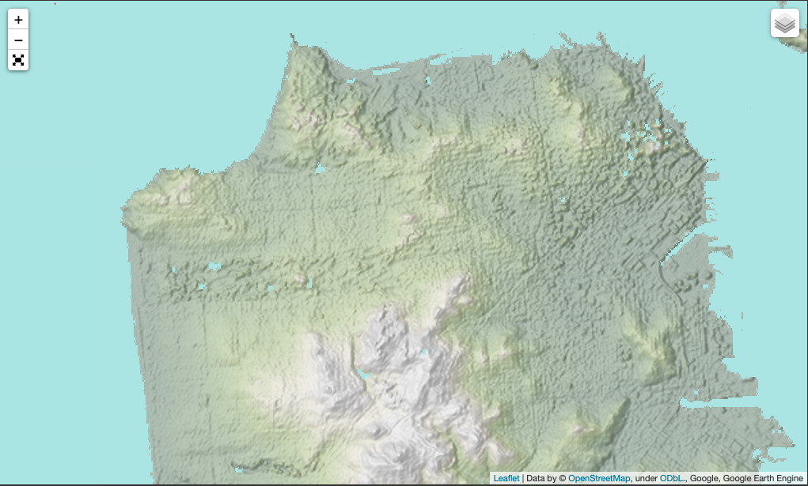

# Deriving Global Hillshade Product</u>

## Table of Contents  
- [Project Details](#project-details)   
- [Data Sources](#data-sources)   
 
___

## Project Details

To create a multi-directional shaded relief product using GEE python API. 

## Data Sources 

### Global (30m)
1. SRTM 
2. ALOS Digital Surface Model (DSM)
3. ETOP01 Bathymetry 

### USA (10m)
1. USGS 3DEP National Map Seamless 
2. USGS NED 

## Intermediate Products 

Slope 
Elevation 
Multi-directional hillshade 

## Results 
- USGS DEM (10m) - Grayscale

- USGS DEM (10m) - Color

  
- GLOBAL SRTM DEM (30m) - Grayscale

  
- GLOBAL SRTM DEM (30m) - Color

  
- GLOBAL ALOS DSM (30m) - Grayscale

  
- GLOBAL ALOS DSM (30m) - Color

## Product Export 

Uploaded into Public Cloud storage bucket: 
- ALOS 30m Example (CA only): https://storage.googleapis.com/global_hillshade/CA_hillshade_v1/shaderelief_export0000000000-0000000000.tif